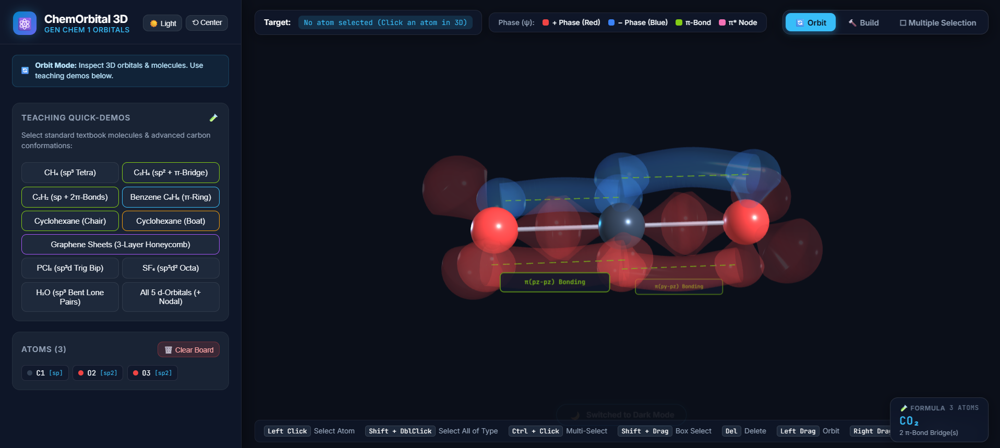

# ChemOrbital 3D - Interactive Chemistry Orbital Visualizer

  

  <strong>An interactive 3D web application designed for General Chemistry students and instructors to visualize atomic and hybridized orbitals, electron phase lobes, VSEPR arrangement envelopes, covalent bonding, and molecular orbital assembly.</strong>

  
  
  
  

## 🔬 Scope & Educational Approach

> [!NOTE]
> **A Note on Physical & Mathematical Modeling:**  
> A fully rigorous quantum chemical calculation of electron densities, molecular conformations, and true nodal wavefunctions requires solving the Schrödinger equation via *ab initio* or DFT methods, accounting for electron point probability distributions, electron-electron repulsions, and spin states. Such computations are beyond the scope of this lightweight mini-project.  
> 
> Instead, **ChemOrbital 3D** focuses on **pedagogical visualization**: it provides pre-rendered geometric conformations, analytical orbital lobe shapes, and spatial alignment tools that allow students to interactively "assemble" molecules, visualize hybridizations, and grasp 3D symmetry concepts taught in General Chemistry 1.

---

## 🖱️ Controls Reference

| Action | Control / Shortcut |
| :--- | :--- |
| **Select Atom** | **Left Click** on atom nucleus |
| **Select All of Same Element** | **Shift + Double Click** on atom or roster badge (e.g. all H, all C, all O) |
| **Toggle Selection (Atom-by-Atom)** | **Ctrl + Left Click** (or Cmd + Click) |
| **Marquee Box Multi-Select** | **Shift + Left Drag** on canvas (or switch to *Multiple Selection* mode) |
| **Delete Selected Atom(s)** | **Delete** or **Backspace** key (or click 🗑️ Delete Atom) |
| **Center / Focus Camera** | **Double Click** (without Shift) on atom or sidebar badge |
| **Switch Modes** | Click **🔄 Orbit**, **🔨 Build**, or **⬚ Multiple Selection** in HUD |
| **Toggle Theme** | Click **☀️ Light** / **🌙 Dark** in top bar (high-contrast black text in light mode) |
| **Cycle Quick Build Orbitals** | **Click active element button again** in Quick Build toolbar (e.g. $sp^3 \to sp^2 \to sp$) |
| **Form Covalent Bond(s)** | Select $\ge 2$ atoms and click **➕ Form Bond(s)** |
| **Remove Covalent Bond(s)** | Select $\ge 2$ atoms and click **➖ Remove Bond(s)** |
| **Auto-Align $p$-Orbitals** | Click **🔄 Align p** in Multiple Selection or Single Atom panel |
| **Overlap / Bridge $\pi$-Orbitals** | Select $\ge 2$ bonded atoms and click **🔗 Form π-Bond Overlap** |
| **Per-Axis Rotation Step** | Click **+90°**, **−90°**, or **180°** under Axis X, Y, or Z in Selected Atom Properties |
| **Clear Canvas** | Click **🗑️ Clear Board** in Atoms roster header |
| **Toggle Arrangement Outline** | Click **📐 Geometric Outline** in Selected Atom Properties (per atom) |
| **Toggle Nodal Surfaces** | Click **⚪ Nodal Surfaces** in Selected Atom Properties (per atom) |
| **Rotate Camera (Orbit)** | **Left Drag** on empty background |
| **Pan Camera** | **Right Drag** (or Middle Click Drag) |
| **Zoom In / Out** | **Mouse Scroll Wheel** |
| **Reset View** | Click **⟲ Center** in top bar |

---

## 🎛️ Detailed Panel Functionality

The interface is structured into dedicated panels and interaction modes to keep controls intuitive and organized. Click on any section below to expand details:

<strong>1. 🧭 Top-Right Mode Switcher & Theme Control</strong>

 

- **🔄 Orbit Mode (Default):** A clean observation mode. Sliders, builders, and orbital palettes are hidden so students and instructors can rotate, pan, and zoom around 3D molecules without clutter.
- **🔨 Build Mode:** Displays the full manual and quick-build sidebar panels for adding, transforming, and styling atoms, orbitals, and covalent bonds.
- **⬚ Multiple Selection Mode:** Displays marquee selection controls, batch atom inspector (group position, rotation, and radius sliders), manual covalent bond tools (`➕ Form Bond(s)` / `➖ Remove Bond(s)`), and phase-accurate orbital overlap bridging tools.
- **☀️ Light / 🌙 Dark Mode Toggle:** Seamlessly switch between dark mode (deep space navy `#0b0f19`) and high-contrast light mode (`#f8fafc` with crisp `#0f172a` black text) optimized for classroom projectors and printed handouts.

<strong>2. 📚 Teaching Quick-Demos (Visible in Orbit Mode)</strong>

 

One-click access to standard textbook molecules and advanced carbon conformations with pre-rendered covalent bonds and orbitals:
- **$CH_4$ (Methane):** Central $sp^3$ Carbon with 4 Hydrogens showing regular tetrahedral $109.5^\circ$ geometry and calibrated $1s$ spheres (Formula: `CH₄`).
- **$C_2H_4$ (Ethylene):** Planar $sp^2$ backbone with parallel $p_z$ orbitals connected by a volumetric $\pi$-bond electron cloud; all four $\text{C}-\text{H}$ covalent bonds pass directly through the axes of the $sp^2$ lobes at $120^\circ$ (Formula: `CH₂=CH₂`).
- **$C_2H_2$ (Acetylene):** Linear $sp$ backbone ($180^\circ$) with two mutually perpendicular in-phase $\pi$ bonds ($\pi_{py}$ and $\pi_{pz}$) (Formula: `HC≡CH`).
- **Benzene ($C_6H_6$):** Planar $sp^2$ hexagonal ring with 3D covalent C-C & C-H bonds, plus continuous delocalized toroidal $\pi$-electron clouds above and below the carbon ring (Formula: `C₆H₆`).
- **Cyclohexane (Chair & Boat):** Visualizes the strain-free $109.5^\circ$ chair conformation (axial vs. equatorial C-H bonds) and the higher-energy boat conformation showing flagpole steric clash (Formula: `C₆H₁₂`).
- **Graphene (3-Layer Honeycomb):** Multilayer hexagonal $sp^2$ lattice with in-plane covalent bonds and vertical dashed interlayer van der Waals coupling lines.
- **$PCl_5$ & $SF_6$:** Demonstrates expanded octets with trigonal bipyramidal ($sp^3d$) and octahedral ($sp^3d^2$) arrangement envelopes.
- **$H_2O$ (Water):** Bent geometry ($104.5^\circ$) showing bonded Hydrogens and lone pair hybrid lobes (Formula: `H₂O`).
- **All 5 $d$-Orbitals:** Side-by-side array of $3d_{xy}, 3d_{xz}, 3d_{yz}, 3d_{x^2-y^2}$, and $3d_{z^2}$ with active coordinate nodal planes and cones.

<strong>3. 🧪 Live Molecular Formula HUD (Bottom-Right Viewport)</strong>

 

A real-time floating card at the bottom-right corner of the canvas dynamically computes and displays the chemical identity of the structure currently on screen:
- **Structural Chemical Formulas:** Automatically recognizes assembled molecules such as `CO₂` (Carbon Dioxide), `NO₂` (Nitrogen Dioxide), `CH₂=CH₂` (Ethylene), `HC≡CH` (Acetylene), `CH₃–CH₃` (Ethane), `CH₄` (Methane), `C₆H₆` (Benzene), `C₆H₁₂` (Cyclohexane), `H₂O` (Water), `NH₃` (Ammonia), `PCl₅`, and `SF₆`.
- **Hill System Formulation:** Automatically parses any custom user-built molecule into standard Hill notation (Carbon first, Hydrogen second, then alphabetical order) with formatted Unicode subscripts ($₀, ₁, ₂, ₃, \dots$).
- **Interaction Summary:** Reports the active count of covalent bonds, $\pi$-bonding bridges, and antibonding $\pi^*$ nodal planes.

<strong>4. 🔨 Build Mode Panels (Quick Build, Manual Atom Tools & Orbital Palette)</strong>

 

#### A. ⚡ Quick Build Tool with Multi-Orbital Cycling
- **8 Element Buttons with Live Badges:** Clean toolbar containing one button per element (**H, C, O, N, S, P, F, Cl**) to eliminate clutter.
- **Click-to-Cycle Orbitals:** Repeatedly clicking an active element button cycles through its chemically meaningful orbital selections with live badge and status bar updates:
  - **Carbon (C):** $sp^3 \to sp^2 \to sp \to sp^3$
  - **Oxygen (O):** $sp^3 \to sp^2 \to sp \to sp^3$
  - **Nitrogen (N):** $sp^3 \to sp^2 \to sp \to sp^3$
  - **Sulfur (S):** $sp^3d^2 \to sp^3 \to sp^2 \to sp^3d \to sp^3d^2$
  - **Phosphorus (P):** $sp^3d \to sp^3 \to sp^3d$
  - **Hydrogen (H):** $1s$
  - **Fluorine / Chlorine (F / Cl):** $p$
- **Lobe-Click Attachment:** Left-click directly on any orbital lobe in 3D to instantly attach a bonding atom at the proper covalent distance along that lobe's vector.
- **Auto-Aligned $p$-Orbitals:** Attaching $sp^2$ or $sp$ atoms automatically calculates orientation so unhybridized $p$-orbitals are parallel and in-phase with the parent atom.
- **Automatic 3D Covalent Bonds:** Automatically connects parent and attached atoms with standard 3D cylindrical covalent bonds.

#### B. ➕ Manual Atom Addition
- **+ Add Atom:** Spawns a new atom in the scene with **no orbital displayed (`none`)** by default, allowing students to pick an orbital type later.
- **Element Chips:** Quick presets for Carbon, Hydrogen, Oxygen, Nitrogen, Sulfur, Phosphorus, Fluorine, and Chlorine that set standard CPK colors and atom radii.

#### C. ⚙️ Selected Atom Properties & Dynamic Local Coordinate Axes
- **Dynamic Local Axes Helper:** When an atom is selected, an RGB 3D local coordinate axes helper (Red=+X, Green=+Y, Blue=+Z) attaches directly to and rotates with that atom in real time.
- **Position Sliders (X, Y, Z):** Smooth translation along coordinate axes with live bond updates.
- **Rotation Sliders (X, Y, Z):** Fine-grained rotation from $0^\circ$ to $360^\circ$ around the atom's local axes.
- **Per-Axis Step Rotation Buttons:** Dedicated 3-row grid for precise transformations:
  - **Axis X:** `+90°` | `−90°` | `180°`
  - **Axis Y:** `+90°` | `−90°` | `180°`
  - **Axis Z:** `+90°` | `−90°` | `180°`
  - **Reset Button:** `⟲ Reset (0°)`
  - **Align Button:** `🔄 Align p` (auto-aligns unhybridized $p$-orbital parallel to bonded neighbor)
- **Nucleus Radius Slider:** Adjusts the CPK sphere size.
- **Name & Color Pickers:** Customize individual atom names and display colors.

#### D. 🌐 Atomic & Hybrid Orbital Palette
- **Atomic Orbitals:** `none`, `s` (sized for realistic bond overlap), `px`, `py`, `pz`, `all p`, and all 5 $d$-orbitals.
- **Hybrid Orbitals:** `sp` (Linear, 180°), `sp²` (Trigonal Planar, 120°), `sp³` (Tetrahedral, 109.5°), `sp³d` (Trigonal Bipyramidal), and `sp³d²` (Octahedral).
- **Auto Parallel $p$-Orbital Alignment on Switch:** Switching an atom's orbital to $sp^2$ or $sp$ automatically projects bonded neighbors' orbital vectors and aligns $p$-orbitals strictly parallel and in-phase.
- **VSEPR Geometric Arrangement Outlines:** Toggleable per-atom wireframe dashed edges and translucent facets (tetrahedral, triangular, bipyramidal, octahedral envelopes).
- **Nodal Surfaces:** Toggleable per-atom coordinate nodal planes where $\psi = 0$ (including the conical nodal surfaces for $d_{z^2}$).

<strong>5. ⬚ Multiple Selection Mode Panel (Batch Editing, Covalent Bonds & π-Overlap)</strong>

 

#### A. Selection Tools
- **Shift + Left Drag:** Draw a 2D rectangular marquee box on the canvas to select multiple atoms.
- **Ctrl + Left Click:** Add or remove atoms from selection one by one.
- **Shift + Double Click:** Automatically selects all atoms in the scene belonging to the same element (e.g. all Hydrogens or all Carbons).

#### B. Manual Covalent Bonding (σ-Bonds)
- **`➕ Form Bond(s)`:** Instantly creates 3D cylindrical covalent bonds between selected atoms (or connects adjacent atoms within bonding distance).
- **`➖ Remove Bond(s)`:** Removes existing covalent bonds between the selected atoms.
- **Live Bond Counter:** Displays the number of active covalent bonds between selected atoms.

#### C. Multi-Atom Inspector & Batch Properties
- When multiple atoms are selected, the Property Inspector remains active:
  - **Group Translations (X, Y, Z):** Moving sliders applies delta offsets $(\Delta X, \Delta Y, \Delta Z)$ to all selected atoms, preserving relative distances and bond lengths.
  - **Group Rotations:** Rotation sliders and the $+90^\circ / -90^\circ / 180^\circ$ step buttons rotate all selected atoms together around their shared center.
  - **Batch Nucleus Sizing & Color:** Scales radii or changes colors of all selected atoms simultaneously.
  - **Batch Hybridization & Outlines:** Apply orbital types, geometric envelopes, or nodal planes in batch.

#### D. ⚡ Phase-Accurate π / π* Overlap & Bridging
- Connects parallel $p$ or hybrid unhybridized lobes between adjacent bonded atoms:
  - **Positive Phase ($+$):** Red (`#ef4444`)
  - **Negative Phase ($-$):** Blue (`#3b82f6`)
- **`🔄 Align p` Button:** Automatically aligns unhybridized $p$-orbitals of all selected atoms parallel and in-phase.
- **`🔗 Form π-Bond Overlap` Button:**
  - **Physically Realistic Sigma-Bond Adjacency Check:** Only adjacent atoms connected by a covalent $\sigma$-bond form $\pi$-bridges. In Benzene, this restricts bridges strictly to the 6 adjacent perimeter bonds, completely preventing crossing chords across the interior of rings.
  - **Constructive Overlap (Same phases face each other):** Red-to-Red and Blue-to-Blue connect into continuous volumetric bonding $\pi$-electron clouds with green central axes passing through the demi-sphere lobe centers.
  - **Destructive Overlap (Opposite phases face each other):** Red faces Blue $\to$ an **Antibonding $\pi^*$ state** is formed with a **vertical planar nodal sheet** midway between the nuclei where electron probability $\psi^2 = 0$.

---

## 💻 Tech Stack

- **Libraries:** Pure vanilla JavaScript with [Three.js](https://threejs.org/) (r128) and OrbitControls loaded via CDN.
- **Architecture:** Zero-dependency standalone HTML file (`index.html`). Can be run completely offline by double-clicking `index.html` in any modern web browser or hosted on static hosts like GitHub Pages.
