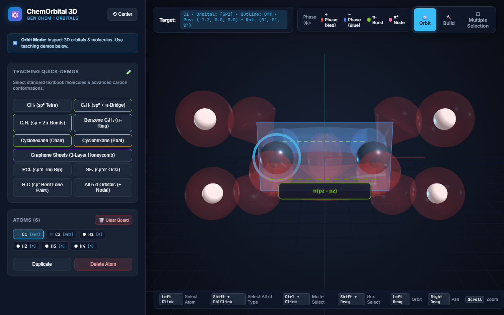
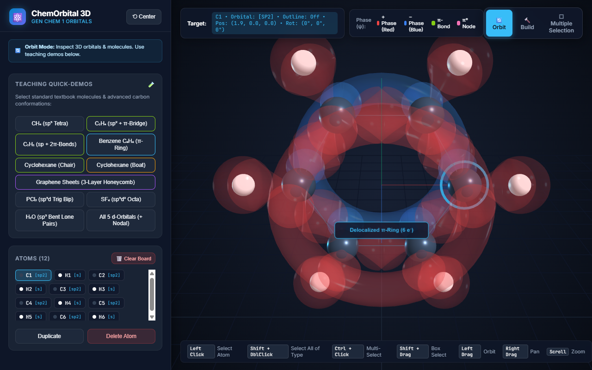
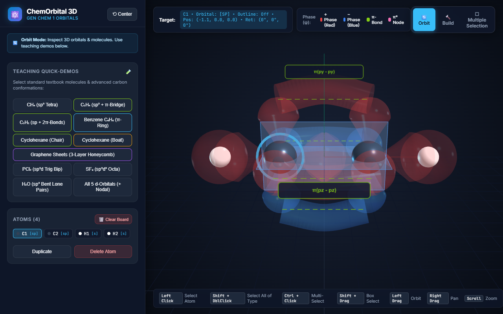
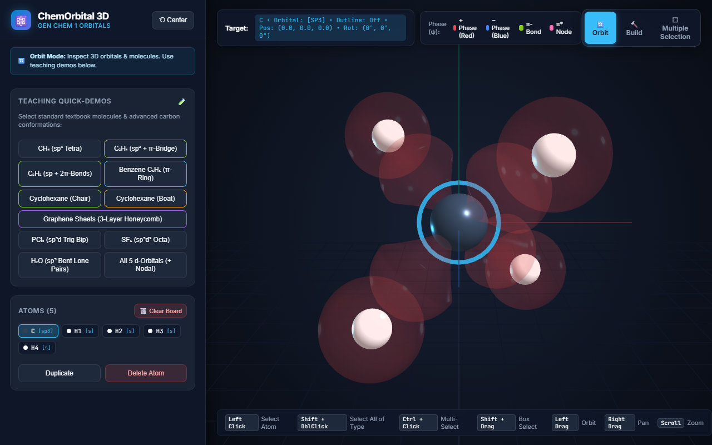
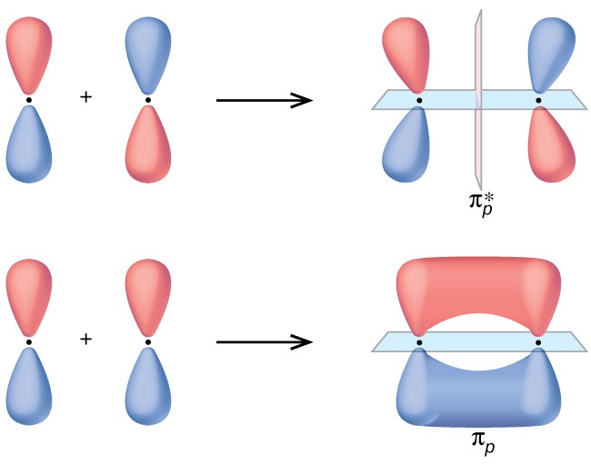
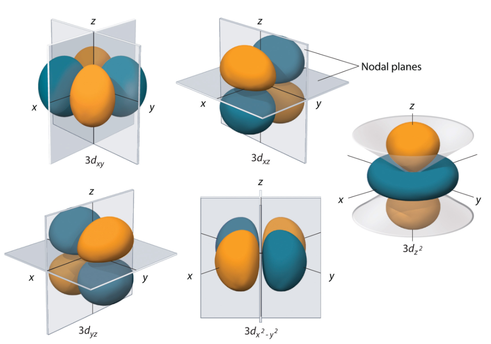
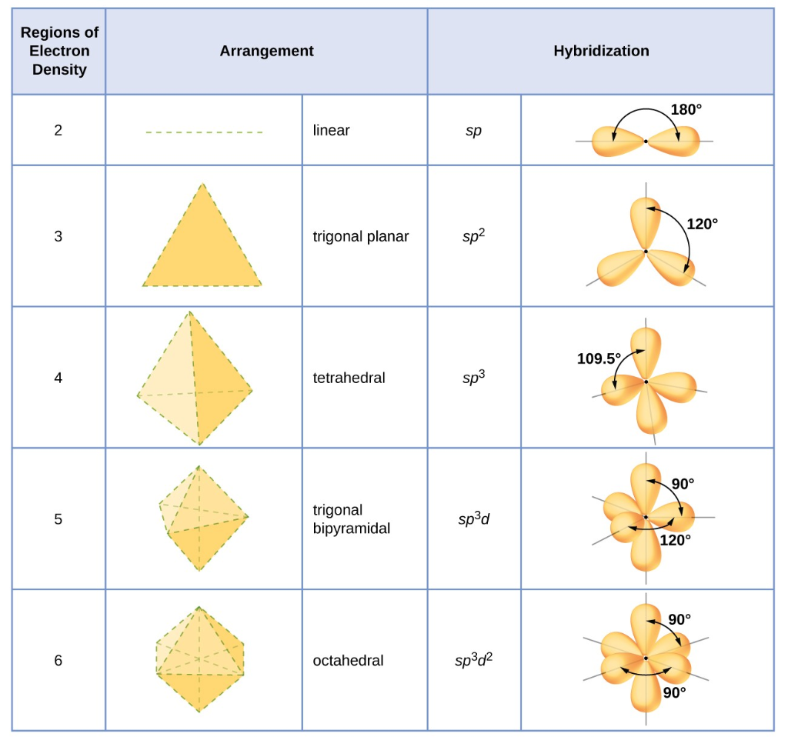

# ChemOrbital 3D - Interactive Chemistry Orbital Visualizer

<p align="center">
  
</p>

<p align="center">
  <strong>An interactive 3D web application designed for General Chemistry students and instructors to visualize atomic and hybridized orbitals, electron phase lobes, VSEPR arrangement envelopes, and &pi; / &pi;* molecular orbital bonding.</strong>
</p>

<p align="center">
  
  
  
  
  
</p>

---

## 📸 Visual Demo Gallery

### 1. Molecular Hybridization & &pi;-Bond Bridging
<table>
  <tr>
    <td width="50%">
      
      <p align="center"><strong>Ethylene ($C_2H_4$):</strong> Planar $sp^2$ backbone + parallel $p_z$ orbitals overlapping into a continuous volumetric $\pi$-electron cloud with internuclear nodal plane.</p>
    </td>
    <td width="50%">
      
      <p align="center"><strong>Benzene ($C_6H_6$):</strong> Planar hexagonal ring with continuous delocalized aromatic $\pi$-electron tori ($6\ e^-$) above and below the carbon ring.</p>
    </td>
  </tr>
  <tr>
    <td width="50%">
      
      <p align="center"><strong>Acetylene ($C_2H_2$):</strong> Linear $sp$ hybridized backbone with two mutually perpendicular in-phase $\pi$ bonds ($\pi_{py}$ and $\pi_{pz}$).</p>
    </td>
    <td width="50%">
      
      <p align="center"><strong>Methane ($CH_4$):</strong> Central tetrahedral $sp^3$ Carbon + 4 bonded Hydrogen $1s$ spheres showing realistic covalent overlap.</p>
    </td>
  </tr>
</table>

### 2. Quantum Phase Overlap & Nodal Surfaces
<table>
  <tr>
    <td width="50%">
      
      <p align="center"><strong>Molecular Orbital Phase Rules:</strong> In-phase (+ with +, − with −) overlap produces constructive Bonding $\pi_p$; out-of-phase (+ with −) overlap creates destructive Antibonding $\pi_p^*$ with a vertical nodal plane.</p>
    </td>
    <td width="50%">
      
      <p align="center"><strong>Complete $d$-Orbital Set:</strong> Active coordinate planar sheets on $d_{xy}, d_{xz}, d_{yz}, d_{x^2-y^2}$ and dual conical nodal surfaces on $d_{z^2}$ ($\theta = 54.74^\circ$).</p>
    </td>
  </tr>
  <tr>
    <td colspan="2">
      
      <p align="center"><strong>VSEPR Electron-Pair Geometries:</strong> Dedicated geometric arrangement envelopes for Linear ($sp$), Trigonal Planar ($sp^2$), Tetrahedral ($sp^3$), Trigonal Bipyramidal ($sp^3d$), and Octahedral ($sp^3d^2$).</p>
    </td>
  </tr>
</table>

---

## 🚀 How to Run

Zero installation, zero build steps, and zero local web servers required.

1. Clone or download this repository:
   ```bash
   git clone git@github.com:hmh-215/Orbital_viewer.git
   ```
2. Double-click **`index.html`** to open directly in Google Chrome, Microsoft Edge, Mozilla Firefox, or Safari.
3. Or launch via PowerShell:
   ```powershell
   Start-Process "E:\huong\Projects\github\Orbital_viewer\index.html"
   ```

---

## 🎛️ Interaction Modes

To maximize learning efficiency and avoid visual clutter, tools are organized into three dedicated workspaces:

### 1. 🔄 Orbit Mode (Default View)
- Uncluttered canvas for inspecting 3D molecules and electron distributions.
- Left-click drag to rotate 3D view; right-click drag to pan; scroll wheel to zoom.
- Double-click any atom to center and smoothly focus the camera.
- All sliders and builder controls are hidden to maintain focus on the 3D chemistry model.

### 2. 🔨 Build Mode
- **Manual Atom Build:** Newly added atoms spawn with **no orbital displayed (`none`)**, allowing students to select their target hybridization deliberately.
- **Dedicated Per-Axis Rotation (+90°, −90°, 180°):**
  - **Axis X:** `+90°` | `−90°` | `180°`
  - **Axis Y:** `+90°` | `−90°` | `180°`
  - **Axis Z:** `+90°` | `−90°` | `180°`
  - **Reset Button:** `⟲ Reset All Rotation (0°)`
- **Click-to-Attach on Lobes:** Hover over any orbital lobe in 3D and left-click to instantly attach a bonding atom at the exact covalent bond distance.

### 3. ⬚ Multiple Selection Mode
- **Shift + Left Drag:** Draw a 2D rectangular marquee box on canvas to select multiple atoms at once.
- **Ctrl + Left Click:** Toggle atoms in and out of selection atom-by-atom.
- **Shift + Double Click:** Select all atoms of the same element across the scene (e.g. all Hydrogens or all Carbons).
- **Active Multi-Atom Inspector:**
  - **Delta Translations (X, Y, Z):** Moving sliders translates the selected group without collapsing bonds.
  - **Batch Rotation:** Sliders and the $+90^\circ / -90^\circ / 180^\circ$ buttons rotate all selected atoms simultaneously.
  - **Nucleus Sizing:** Sliders adjust the CPK radius of all selected atoms in batch.
- **⚡ Phase-Accurate &pi; / &pi;* Bonding (`🔗 Overlap (π / π*)`):**
  - **Constructive In-Phase Overlap (Red-to-Red, Blue-to-Blue):** Continuous volumetric electron clouds with a horizontal internuclear nodal plane ($\pi_p$).
  - **Destructive Out-of-Phase Overlap (Red faces Blue):** An Antibonding $\pi^*$ state forms with a **vertical planar nodal sheet** midway between the nuclei ($\pi_p^*$).
  - **`🔄 Align Phases (180°)`:** One-click rotation to invert one atom's phase by $180^\circ$ and form constructive bonding.

---

## 🧪 11 Built-in Teaching Demos

| Demo | Chemistry Concept Demonstrated |
| :--- | :--- |
| **$CH_4$ (Methane)** | Central $sp^3$ Carbon with 4 Hydrogens; tetrahedral $109.5^\circ$ bond angles with realistic $s$-orbital overlap |
| **$C_2H_4$ (Ethylene)** | Planar $sp^2$ backbone + parallel $p_z$ orbitals with continuous volumetric $\pi$-bond bridge |
| **$C_2H_2$ (Acetylene)** | Linear $sp$ hybridization ($180^\circ$) + dual perpendicular $\pi_y$ and $\pi_z$ bridges |
| **Benzene ($C_6H_6$)** | Planar $sp^2$ hexagonal ring with continuous delocalized aromatic $\pi$-electron tori ($6\ e^-$) |
| **Cyclohexane (Chair)** | Strain-free $109.5^\circ$ puckered conformation with alternating vertical axial and equatorial C-H bonds |
| **Cyclohexane (Boat)** | High-energy boat conformation demonstrating inward-pointing "flagpole" Hydrogens |
| **Graphene (3-Layer)** | Multilayer hexagonal $sp^2$ graphene lattices with vertical dashed interlayer van der Waals coupling lines |
| **$PCl_5$ (Phosphorus Pentachloride)** | Central $sp^3d$ Phosphorus with trigonal bipyramidal arrangement envelope ($90^\circ$ and $120^\circ$) |
| **$SF_6$ (Sulfur Hexafluoride)** | Central $sp^3d^2$ Sulfur with regular octahedral arrangement envelope ($90^\circ$) |
| **$H_2O$ (Water)** | Central Oxygen $sp^3$ bent geometry ($104.5^\circ$) with two bonded Hydrogens and two lone pair lobes |
| **All 5 $d$-Orbitals** | Complete degenerate set ($3d_{xy}, 3d_{xz}, 3d_{yz}, 3d_{x^2-y^2}, 3d_{z^2}$) side-by-side with active nodal planes & cones |

---

## 🖱️ Controls & Keyboard Shortcuts

| Action | Mouse / Keyboard Shortcut |
| :--- | :--- |
| **Select Atom** | **Left Click** on atom nucleus |
| **Select All of Type** | **Shift + Double Click** on atom (e.g. all H, all C) |
| **Multi-Select (Atom-by-Atom)** | **Ctrl + Left Click** (or Cmd + Click) to toggle |
| **Multi-Select (Box Marquee)** | **Shift + Left Drag** (or switch to *Multiple Selection* mode) |
| **Focus Camera on Atom** | **Double Click** (without Shift) on atom or sidebar badge |
| **Switch Modes** | Click **🔄 Orbit**, **🔨 Build**, or **⬚ Multiple Selection** in top-right HUD |
| **Overlap Orbitals (&pi; / &pi;*)** | Select $\ge 2$ atoms and click **🔗 Overlap (π / π*)** |
| **Auto-Align Phases** | Click **🔄 Align Phases (180°)** in Multiple Selection card |
| **Step Rotation per Axis** | Click **+90°**, **−90°**, or **180°** under Axis X, Y, or Z in Selected Atom Properties |
| **Clear Board** | Click **🗑️ Clear Board** in Atoms roster header |
| **Toggle Arrangement Outline** | Click **📐 Geometric Outline** in Selected Atom Properties (per atom) |
| **Toggle Nodal Surfaces** | Click **⚪ Nodal Surfaces** in Selected Atom Properties (per atom) |
| **Rotate View (Orbit)** | **Left Drag** on empty canvas |
| **Pan Camera** | **Right Drag** (or Middle Click Drag) |
| **Zoom In / Out** | **Mouse Scroll Wheel** |
| **Center / Reset View** | Click **⟲ Center** in top-left bar |

---

## 🛠️ Architecture & Technology Stack

- **Graphics Engine:** Three.js (r128) via CDN with OrbitControls.
- **Custom Geometries:** Analytical lobe profiles using cubic bezier cross-sections with parametric displacement, tube catmull-rom curve extrusions, and geometric envelopes.
- **Zero Build Tools:** Single standalone HTML file with internal CSS and vanilla JavaScript. Runs offline and is 100% compatible with GitHub Pages.

---

## 📄 License

This project is licensed under the [MIT License](LICENSE).
