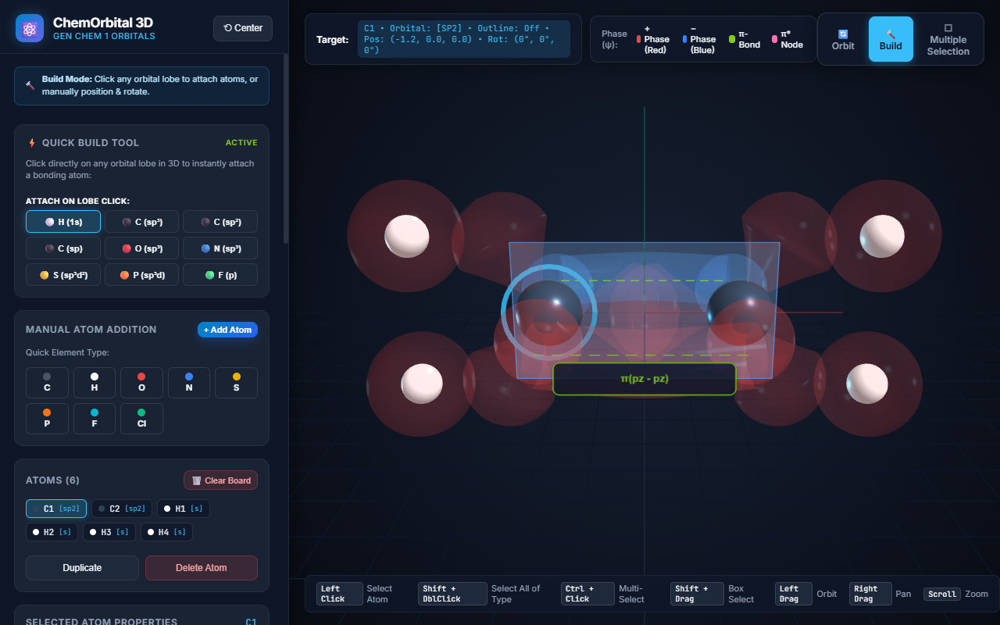

# ChemOrbital 3D - Interactive Chemistry Orbital Visualizer

  

  <strong>An interactive 3D web application designed for General Chemistry students and instructors to visualize atomic and hybridized orbitals, electron phase lobes, VSEPR arrangement envelopes, and molecular orbital assembly.</strong>

  
  
  
  

> [!TIP]
> **Try it in your browser:** [**https://hmh-215.github.io/Orbital_viewer/**](https://hmh-215.github.io/Orbital_viewer/) (Single-file HTML app, zero installation required).

---

## 🔬 Scope & Educational Approach

> [!NOTE]
> **A Note on Physical & Mathematical Modeling:**  
> A fully rigorous quantum chemical calculation of electron densities, molecular conformations, and true nodal wavefunctions requires solving the Schrödinger equation via *ab initio* or DFT methods, accounting for electron point probability distributions, electron-electron repulsions, and spin states. Such computations are beyond the scope of this lightweight mini-project.  
> 
> Instead, **ChemOrbital 3D** focuses on **pedagogical visualization**: it provides pre-rendered geometric conformations, analytical orbital lobe shapes, and spatial alignment tools that allow students to interactively "assemble" molecules, visualize hybridizations, and grasp 3D symmetry concepts taught in General Chemistry 1.

---

## 📸 Interface Overview

  

---

## 🎛️ Detailed Panel Functionality

The interface is structured into dedicated panels and interaction modes to keep controls intuitive and organized:

### 1. 🧭 Top-Right Mode Switcher & Theme Control
- **🔄 Orbit Mode (Default):** A clean observation mode. Sliders, builders, and orbital palettes are hidden so you can rotate, pan, and zoom around 3D molecules without clutter.
- **🔨 Build Mode:** Displays the full manual and quick-build sidebar panels for adding, transforming, and styling atoms and orbitals.
- **⬚ Multiple Selection Mode:** Displays the marquee selection controls, batch atom inspector, batch styling palette, and orbital overlap bridging tools.
- **☀️ Light / 🌙 Dark Mode Toggle:** Seamlessly switch between dark mode (deep space navy `#0b0f19`) and high-contrast light mode (`#f8fafc`) for classroom projectors and print-outs.

---

### 2. 📚 Teaching Quick-Demos (Visible in Orbit Mode)
One-click access to 11 pre-assembled molecular conformations with 3D covalent bond lines:
- **$CH_4$ (Methane):** Central $sp^3$ Carbon with 4 Hydrogens showing regular tetrahedral $109.5^\circ$ geometry and calibrated $1s$ spheres.
- **$C_2H_4$ (Ethylene):** Planar $sp^2$ backbone with parallel $p_z$ orbitals connected by a volumetric $\pi$-bond electron cloud and covalent C-C & C-H bonds.
- **$C_2H_2$ (Acetylene):** Linear $sp$ backbone ($180^\circ$) with two mutually perpendicular in-phase $\pi$ bonds ($\pi_{py}$ and $\pi_{pz}$).
- **Benzene ($C_6H_6$):** Planar $sp^2$ hexagonal ring with continuous delocalized toroidal $\pi$-electron clouds above and below the carbon ring.
- **Cyclohexane (Chair & Boat):** Visualizes the strain-free $109.5^\circ$ chair conformation (axial vs. equatorial C-H bonds) and the higher-energy boat conformation.
- **Graphene (3-Layer Honeycomb):** Multilayer hexagonal $sp^2$ lattice with in-plane covalent bonds and vertical dashed interlayer van der Waals coupling lines.
- **$PCl_5$ & $SF_6$:** Demonstrates expanded octets with trigonal bipyramidal ($sp^3d$) and octahedral ($sp^3d^2$) arrangement envelopes.
- **$H_2O$ (Water):** Bent geometry ($104.5^\circ$) showing bonded Hydrogens and lone pair hybrid lobes.
- **All 5 $d$-Orbitals:** Side-by-side array of $3d_{xy}, 3d_{xz}, 3d_{yz}, 3d_{x^2-y^2}$, and $3d_{z^2}$ with active coordinate nodal planes and cones.

---

### 3. 🔨 Build Mode Panels

#### A. ⚡ Quick Build Tool with Intelligent Parallel $p$-Orbital Alignment
- Hover over any active orbital lobe in the 3D scene and **left-click** to instantly attach a bonding atom (e.g. `H(1s)`, `C(sp³)`, `C(sp²)`, `C(sp)`, `O`, `N`, `S`, `P`, `F`) at the exact covalent bond distance along that lobe's vector.
- **Automatic Parallel Alignment for $sp^2$ and $sp$:** Newly attached $sp^2$ and $sp$ carbon atoms automatically orient their unhybridized $p$-orbitals strictly parallel to the parent's $p$-orbitals with matching mathematical phase signs (+ lobe Red to + lobe Red, − lobe Blue to − lobe Blue), making subsequent $\pi$-bonding instantaneous.
- **Automatic 3D Covalent Bonds:** Creates sleek 3D covalent bond cylinders connecting parent and newly attached atoms.

#### B. ➕ Manual Atom Addition
- **+ Add Atom:** Spawns a new atom in the scene with **no orbital displayed (`none`)** by default, allowing students to pick an orbital type later.
- **Element Chips:** Quick presets for Carbon, Hydrogen, Oxygen, Nitrogen, Sulfur, Phosphorus, Fluorine, and Chlorine that set standard CPK colors and atom radii.

#### C. ⚙️ Selected Atom Properties & Dynamic Local Coordinate Axes
- **Dynamic Local Axes Helper:** When an atom is selected, an RGB 3D local coordinate axes helper (Red=+X, Green=+Y, Blue=+Z) attaches directly to and rotates with that atom in real time.
- **Position Sliders (X, Y, Z):** Smooth translation along coordinate axes with live bond updates.
- **Rotation Sliders (X, Y, Z):** Fine-grained rotation from $0^\circ$ to $360^\circ$ around the atom's local axes.
- **Per-Axis Step Rotation Buttons:** Dedicated 3-row grid for precise transformations:
  - **Axis X:** `+90°` | `−90°` | `180°`
  - **Axis Y:** `+90°` | `−90°` | `180°`
  - **Axis Z:** `+90°` | `−90°` | `180°`
  - **Reset Button:** `⟲ Reset All Rotation (0°)`
- **Nucleus Radius Slider:** Adjusts the CPK sphere size.
- **Name & Color Pickers:** Customize individual atom names and display colors.

#### D. 🌐 Atomic & Hybrid Orbital Palette
- **Atomic Orbitals:** `none`, `s` (sized for realistic bond overlap), `px`, `py`, `pz`, `all p`, and all 5 $d$-orbitals.
- **Hybrid Orbitals:** `sp` (Linear, 180°), `sp²` (Trigonal Planar, 120°), `sp³` (Tetrahedral, 109.5°), `sp³d` (Trigonal Bipyramidal), and `sp³d²` (Octahedral).
- **VSEPR Geometric Arrangement Outlines:** Toggleable per-atom wireframe dashed edges and translucent facets (tetrahedral, triangular, bipyramidal, octahedral envelopes).
- **Nodal Surfaces:** Toggleable per-atom coordinate nodal planes where $\psi = 0$ (including the conical nodal surfaces for $d_{z^2}$).

---

### 4. ⬚ Multiple Selection Mode Panel

#### A. Selection Tools
- **Shift + Left Drag:** Draw a 2D rectangular marquee box on the canvas to select multiple atoms.
- **Ctrl + Left Click:** Add or remove atoms from selection one by one.
- **Shift + Double Click:** Automatically selects all atoms in the scene belonging to the same element (e.g. all Hydrogens or all Carbons).

#### B. Multi-Atom Inspector
- When multiple atoms are selected, the Property Inspector remains active:
  - **Group Translations (X, Y, Z):** Moving sliders applies delta offsets $(\Delta X, \Delta Y, \Delta Z)$ to all selected atoms, preserving relative distances and bond lengths.
  - **Group Rotations:** Rotation sliders and the $+90^\circ / -90^\circ / 180^\circ$ step buttons rotate all selected atoms together.
  - **Batch Nucleus Sizing:** Scales the radii of all selected atoms simultaneously.

#### C. ⚡ Phase-Accurate &pi; / &pi;* Overlap & Bridging
- Connects parallel $p$ or hybrid unhybridized lobes between selected atoms:
  - **Positive Phase ($+$):** Red (`#ef4444`)
  - **Negative Phase ($-$):** Blue (`#3b82f6`)
- **`🔗 Overlap (π / π*)` Button:**
  - **Constructive Overlap (Same phases face each other):** Red-to-Red and Blue-to-Blue connect into continuous volumetric bonding $\pi$-electron clouds with a horizontal internuclear nodal plane ($\pi_p$).
  - **Destructive Overlap (Opposite phases face each other):** Red faces Blue $\to$ an **Antibonding $\pi^*$ state** is formed with a **vertical planar nodal sheet** midway between the nuclei ($\pi_p^*$) and informative guidance on rotating the atom.
- **`🔄 Align Phases (180°)` Button:** Automatically rotates the second atom by $180^\circ$ to flip its phase and achieve constructive bonding.

---

## 🖱️ Controls Reference

| Action | Control / Shortcut |
| :--- | :--- |
| **Select Atom** | **Left Click** on atom nucleus |
| **Select All of Same Element** | **Shift + Double Click** on atom (e.g. all H, all C) |
| **Toggle Selection (Atom-by-Atom)** | **Ctrl + Left Click** (or Cmd + Click) |
| **Marquee Box Multi-Select** | **Shift + Left Drag** (or switch to *Multiple Selection* mode) |
| **Delete Selected Atom(s)** | **Delete** or **Backspace** key (or click 🗑️ Delete Atom) |
| **Center / Focus Camera** | **Double Click** (without Shift) on atom or sidebar badge |
| **Switch Modes** | Click **🔄 Orbit**, **🔨 Build**, or **⬚ Multiple Selection** in HUD |
| **Toggle Theme** | Click **☀️ Light** / **🌙 Dark** in sidebar header |
| **Overlap / Bridge Orbitals** | Select $\ge 2$ atoms and click **🔗 Overlap (π / π*)** |
| **Align Overlap Phases** | Click **🔄 Align Phases (180°)** in Multiple Selection card |
| **Per-Axis Rotation Step** | Click **+90°**, **−90°**, or **180°** under Axis X, Y, or Z in Selected Atom Properties |
| **Clear Canvas** | Click **🗑️ Clear Board** in Atoms roster header |
| **Toggle Arrangement Outline** | Click **📐 Geometric Outline** in Selected Atom Properties (per atom) |
| **Toggle Nodal Surfaces** | Click **⚪ Nodal Surfaces** in Selected Atom Properties (per atom) |
| **Rotate Camera (Orbit)** | **Left Drag** on empty background |
| **Pan Camera** | **Right Drag** (or Middle Click Drag) |
| **Zoom In / Out** | **Mouse Scroll Wheel** |
| **Reset View** | Click **⟲ Center** in top-left bar |

---

## 💻 Tech Stack

- **Libraries:** Pure vanilla JavaScript with [Three.js](https://threejs.org/) (r128) and OrbitControls loaded via CDN.
- **Architecture:** Zero-dependency standalone HTML file (`index.html`). Can be run completely offline or hosted on any static web server / GitHub Pages.
